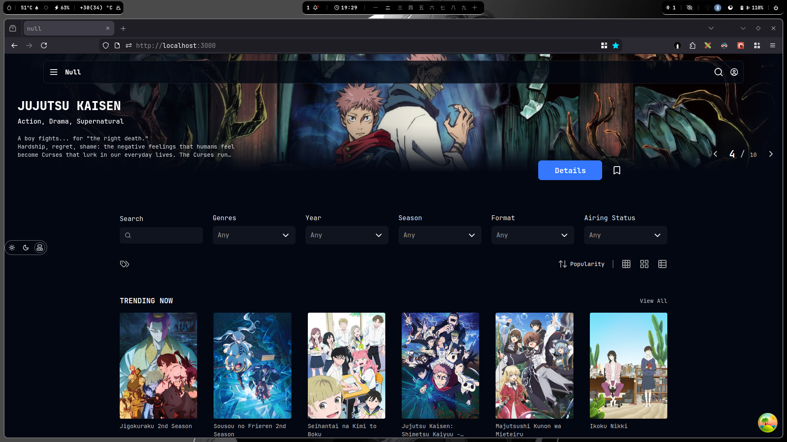

##### Unfinished work, thus the name 'null'. Also means that bugs are expected. 
 


##### Prereq:
- Node installed
- pnpm installed
- graphql basics

---
##### Setup:
```bash
git clone https://github.com/isMaya404/null 
cd null
pnpm i
pmpm codegen
pnpm dev
```

---
##### Working with AniList GraphQL:
This project is built around the AniList GraphQL API. Familiarity with their schema and query structure is essential to navigate and extend the codebase.

- Docs: https://docs.anilist.co/guide/introduction
- GraphQL IDE (quickly test out their API): https://studio.apollographql.com/sandbox/explorer

Adding or Modifying Queries
1. Add or update GraphQL operations in: **@/lib/anilist/queries.gql**
2. Always run: ```pnpm codegen```
This regenerates the typed GraphQL documents, variables, and response types in: **@/lib/anilist/gql/**

These generated files are used throughout the app to ensure fully type-safe communication with AniList.
If you do not run codegen after modifying queries, TypeScript types will be stale and may cause runtime or type errors.
